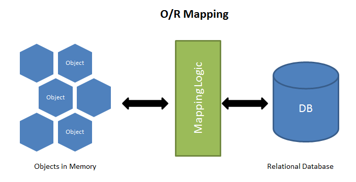
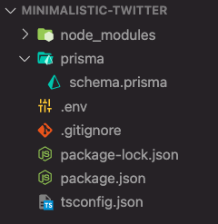
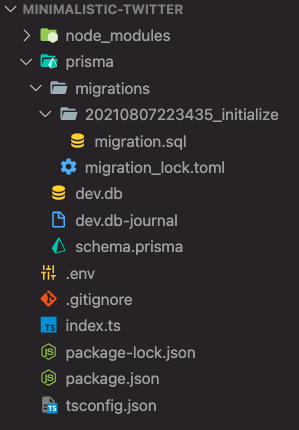

# Construire une base de données Node.js en utilisant [Prisma](https://www.prisma.io/) et [SQLite](https://www.sqlite.org/index.html)

---

<div style="text-align:center"></div>

## Qu'est ce que Prisma ?

Prisma est ce qu'on appelle un [ORM](https://fr.wikipedia.org/wiki/Mapping_objet-relationnel) *Object Relational Mapping*. C'est un ensemble de librairie qui vous permettent d'intéragir de manière plus simple avec vos données en la notion d'objet.

Voici une liste d'ORM :
    - [Mongoose](https://mongoosejs.com/)
    - [SQLite](https://www.sqlite.org/index.html)
    - [RedBean](https://redbeanphp.com/index.php)
    - [Doctrine]()



##### Est-ce que studio 3T est un ORM ?

Pas que, Studio c'est un GUI pour gérer des bases de données MongoDB.

*Bastien C. ~ Castres*

##### Est-ce que FakerJS est un ORM ?

Non, fakerJS est une solution de ***seed*** pour les bases de données.

*Myriem S.  ~ Castres*

---

Un débat s’installe très souvent entre les développeurs. Les ORM sont venus avec pour vocation : la réduction du code à écrire et à maintenir pour l’informaticien qui manipule la base de données depuis son logiciel. Néanmoins, bien que ces avantages semblent très souvent les plus recherchés par les développeurs, les spécialistes des bases de données leur trouvent beaucoup de défauts.

| Avantage        | Inconvénients   |
| :---------------:| :----------:   |
| Homogénéité  |      Performance          |
| Abstraction du SQL  |   Nouvel outil à apprendre            |
|  Portabilité |   Dépendant de l'outil             |
| Migration facilité |    Configuration complexe            |
|   |    Requête complexe            |

## Construire une base de donnée pour Twitter

Nous allons construire et manipuler une base de données  en Node.js, Prisma et SQLite.

SQLite est un ***moteur de base de données*** autonome. Donc pas besoin de configurer une base de données sur votre ordinateur. Le projet fonctionnera par lui-même si vous suivez les étapes de ce tutoriel.

## Prérequis

- Notions de Javascript et de NodeJS
- Notions de Typescript
- **Installation global de ts-node WARNING**
- Notions de SQL
  
## Setup

Si vous cloner ce repos, exécuter la commande suivante :

```bash
    #terminal
    npm install
```

D'abord, créer votre répertoire de travail.

```bash
    #terminal
    mkdir jeremy_de_castres
    cd jeremy_de_castres
```
Vérifier bien votre version de node : ici 18.0.0.

```bash
    #terminal
    node -v
```

Si besoin changer de version à l'aide de nvm.

```bash
    #terminal
    nvm use 18.0.0
```

Ensuite, initialiser votre projet Node.

```bash
    #terminal
    npm init
    npm install prisma typescript ts-node @types/node --save-dev
    npm install @prisma/client
```

Normalement dans votre répertoire vous avez :
    - *node_modules*
    - package.json
    - package-lock.json

Présenter des explications *Explication sur les dépendances*

***Prisma*** est une base de données open-source. Il comprend un ORM JavaScript/TypeScript pour Node.js, des migrations et une interface graphique moderne pour visualiser et modifier les données dans votre base de données. Vous pouvez utiliser Prisma dans de nouveaux projets ou l’ajouter à un projet existant.

***typescript*** est un package pour compiler et exécuter du Typescript (Javascript typé).

***ts-node*** Environnement d’exécution TypeScript et REPL pour node.js, avec support de carte source.

***@types/node*** 

***@prisma/client*** est un ORM JavaScript/TypeScript pour Node.js auto-généré, sécurisé et moderne, adapté à vos données. Prend en charge les bases de données MySQL, PostgreSQL, MariaDB, SQLite.

##### NPX ou NPM ?

Npm est un outil qui utilise pour installer des paquets. Npx est un outil qui utilise pour exécuter des paquets.

*Marie A. ~ Castres*

##### Y sert à quoi le save-dev ?

Ce sont les paquets dont vous avez besoin lors du développement du projet, mais pas lors du déploiement du projet. Ces paquets ne sont pas construits lorsque le projet est déployé. Exemple : Un paquet pour serveur instantané pour le rerendering rapide d’une page Web en cours de développement.

*Bastien C. ~ Castres*

***Avant toute chose***, dès lors que vous travaillez en *Typescript*, vous devez déclarer un fichier *tsconfig.json* à la racine du répertoire.

```json
    //tsconfig.json
{
  "compilerOptions": {
    "sourceMap": true,
    "outDir": "dist",
    "strict": true,
    "lib": ["esnext"],
    "esModuleInterop": true
  }
}
```

Maintenant que nous avons setup notre projet, il est temps d'utiliser Prisma. La commande ci-dessous va permettre d'afficher le helper de prisma. Vous avez accès à toutes les commandes prisma.

```bash
    #terminal
    npx prisma
```

Maintenant, la dernière étape avant de construire notre application est d’initialiser la configuration de la base de données.

```bash
    #terminal
    npx prisma init --datasource-provider sqlite
```

Lorsque vous exécuter la commande, vous devriez trouver dans votre dépôt un fichier <.env> et un dossier prisma avec un fichier schema.prisma à l’intérieur.

Le fichier schema.prisma contient toutes les instructions pour se connecter à votre base de données. Plus tard, il contiendra également les instructions pour générer vos tables de base de données.

Le fichier . env contient toutes les variables d’environnement dont votre projet a besoin pour fonctionner. Pour Prisma, la seule variable est ***DATABASE_URL.*** Sa valeur est définie sur . /dev.db .

<div style="text-align:center"></div>

<div style="text-align:center">Arborescence à ce stade du projet 🎉</div>

## Modèle utilisateur et Tweet

Comment vas-ton construire notre premier modèle ? Il faut savoir dans un premier temps quelles sont les entités qui vont constituer notre BDD :
- Utilisateur : Informations sur l'utilisateur de la plateforme (nom, prénom, ...)
- Message/Tweet (Nb de like, url, id, contenu)

Voici un exemple de modèle prisma à compléter. Voici le lien vers la documentation PRISMA pour plus d'informations : [Doc](https://www.prisma.io/docs/reference/api-reference/prisma-schema-reference#unique)

```ts
    //schema.prisma
    model User {
        id  Int @id @default(autoincrement())
        profilePic String 
        dob DateTime
        //À Compléter
    }
```
  
## Migration de base de donnée

La première chose que l'on doit faire une fois nos modèle créer, c'est de générer notre base de donnée. Nous allons utiliser une nouvelle commande prisma *migrate*

```bash
    #terminal
    npx prisma migrate dev --name bastien_de_castres
```

Si votre migration est correcte ✅ cela veut dire que votre schéma de BDD est bien conçu.

À cette étape, votre arborescence ressemble à cela :

<div style="text-align:center"></div>

<div style="text-align:center">Youpiiii</div>

Notre base de données est prête, il est temps de commencer à s'amuser avec !

## Test de la BDD avec un projet Node Sqlite

Première étape, créer un fichier index.ts avec la commande suivante :

```bash
    #terminal
    touch index.ts
```

Premièrement, nous devons importer et initialiser la connection à notre BDD.
Pour cela, afin de structurer notre projet, nous allons créer deux répertoire config et Database.

```bash
    #terminal
    mkdir config && cd config && mkdir database && cd database && touch prisma.ts
```

Une fois ceci fait, on va s'atteler à la connection à la base de donnée. Voici un schéma qui explique comment prisma interagi avec la BDD.

<div style="text-align:center"></div>


La première chose à faire, importer PrismaClient pour initialiser notre base de données.

```ts
    //index.ts
    import { PrismaClient } from '@prisma/client';
```

Ensuite, il faut déclarer une constante Prisma client que l'on va exporter.

Retourner dans votre **index.ts** et importer votre constante.

```ts
    //index.ts
    import { PRISMA }from './config/database/prisma';
```

Pour lancer votre serveur, créer une fonction main contenant un try/catch.

```ts
    //index.ts
    function main() {
        try{
            //traitement
        }
        catch(error:any) {
            //traitement erreur
        }
        finally{ 
            //fin de traitement
        }
    }
```

Vous allez devoir compléter les commentaires pour faire votre traitement. 

//traitement et création de notre utilisateur

```ts
    //index.ts
    async function main() {
    try {  
        APP.listen(3000, () => {
            console.log('✅ : Server is running on port 3000')
            //traitement
        }) 
    }
    catch(error:any) {
        throw new Error(error);
    }
    finally{
        async () => {
            await PRISMA.$disconnect();
        }  
    }
}


main()
```

## Créer une appi

Pour pouvoir lancer votre serveur, installer express.

```bash
    #terminal
    npm i express 
```

Ensuite lorsque l'on travail en TS, il faut installer le package pour le typage de ce module.

```bash
    #terminal
    npm i --save-dev @types/express
```

Pour éviter d'avoir a kill et relancer notre serveur à chaque fois, on va installer nodemon.

```bash
    #terminal
    npm i --save-dev nodemon
```

Une  fois nodemon installé, nous allons implémenter notre design pattern.

```bash
    #terminal
    mkdir controllers && mkdir routes && mkdir services && cd routes && mkdir public && mkdir private && cd public && touch openRoutes.ts
```

Import le module express.

```ts
    //routes/public/openRoutes.ts
    import {Express, Request, Response} from 'express';     
```

Déclarer une fonction qui va gérer toutes mes routes non-restreintes.

```ts
    //routes/public/openRoutes.ts
    function openRoutes(app:Express) {
    app.get('/', (req: Request, res: Response) => {
        res.status(200).send({
            'message':'Server is running successfully 🛣️'})
    })
}

export default openRoutes;
```

Importer la fonction openRoutes dans index.ts.

```ts
    //index.ts
    import  openRoutes  from './routes/public/openRoutes'
```

Appeler la fonction dans la fonction callback de APP.listen() et surprise : on peut tester notre route directement avec POSTMAN ou avec votre navigateur préféré. Votre première route est prête ✅.

<div style="text-align:center"></div>

Une fois votre serveur lancé, nous allons créer notre première route.

Il est important de bien comprendre l'architecture d'une API et votre design pattern.

<div style="text-align:center"></div>

Vos endpoints sont déclaréer dans votre dossier **routes**. Les routes vont faire appels à des middlewares pour formater vos données.

La couche Controller gère les requêtes des utilisateurs. Elle est responsable de retourner une réponse avec l’aide mutuelle des couches Model et Vue.

La couche services gère toutes votre logique, vos requêtes vers la base de données.
## POST User

Dans votre fichier route, créer le endpoint correspondant à la fonctionnalité désirée.

Voici un guide sur le naming de vos endpoints :

<div style="text-align:center"></div>

avec un lien vers une [documentation](https://restfulapi.net/resource-naming) plus complète.

```ts
    //routes/public/openRoutes.
    app.post('_nom_de_votre_endpoint_', (req: Request, res: Response) => {
        //fonction déclaré dans votre controller
        //exemple : creerUtilisateur(req, res)
    })
```

Ensuite, créer votre fonction dans votre controller.

```ts
    //controller/user.ts
    export async function _nom_de_votre_controller_(req: Request, res: Response) {
    try{
        //call de votre services
        res.status(200).send({
            'message' : 'success'
        })
    } catch(error: any) {
        res.status(400).send({
            'message' : error
        })
    }
}
```

Deuxiemement, nous allons créer la fonction correspondante dans le repértoire.

Et enfin vous créer le service correspondant.
## GetAll Users